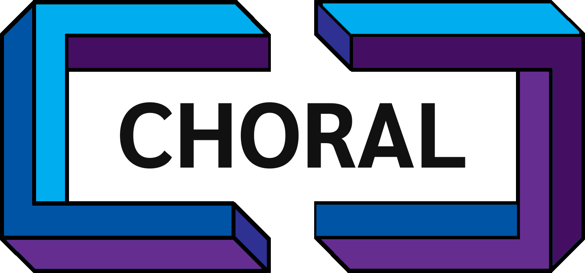

Projects list: 
[AIOCJ](#aiocj) | [APP](#app) | [Choral](#choral) | [Jolie](#jolie) | [JIoT](#jiot) | [Tquery](#tquery) | [SMAll](#small)

Utilities:

- [DBLP Rank](https://openuserjs.org/scripts/thesave/Rank_DBLP): a script to add the ranking of conferences (from GII-GRIN-SCIE) and journals (from SCIMAGO) to a DBLP researcher's page

<h1 id="choral">Choral</h1>

<a href="https://www.choral-lang.org">Choral</a>
is a language for the programming of choreographies. A choreography is a multiparty protocol that defines how some roles (the proverbial Alice, Bob, etc.) should coordinate with each other to do something together.

Choral is designed to help developers program distributed authentication protocols, cryptographic protocols, business processes, parallel algorithms, or any other protocol for concurrent and distributed systems. At the press of a button, the Choral compiler translates a choreography into a library for each role. Developers can use the generated libraries to make sure that their programs (like a client, or a service) follow your choreography correctly. Choral makes sure that the generated libraries are compliant implementations of the source choreography, making programmers more productive, and preventing them from writing incompatible implementations of communications.

Choral is currently interoperable with Java (and it is planned to support also other programming languages). Choral is compatible with Java in three ways: 1) its syntax is a direct extension of Java (if you know Java, Choral is just a step away); 2) Choral code can reuse Java libraries; 3)
the libraries generated by Choral are in pure Java with APIs that the programmer controls, and that can be used inside of other Java projects directly.

My contribution

I am part of the <a href="https://www.choral-lang.org/about.html">Choral
team</a>, working on the theory behind the language and its development.

<h1 id="app">APP</h1>

 

Serverless computing is a Cloud development paradigm where developers write and
compose stateless functions, abstracting from their deployment and scaling. <a
href="https://github.com/giusdp/openwhisk">APP</a> is a declarative language of
Allocation Priority Policies to specify policies that inform the scheduling of
Serverless function execution to optimise their performance against some
user-defined goals. APP is currently implemented as a prototype extension of the
Serverless <a href="https://openwhisk.apache.org/">Apache OpenWhisk</a>
platform.

My contribution

I am one of the main contributors in the <a href="/publications/icsoc2020/">design of the APP language</a>.

<h1 id="aiocj">AIOCJ</h1>

 <a
href="http://www.cs.unibo.it/projects/jolie/aiocj.html">AIOCJ</a> is a
<em>choreography</em> programming language for developing <em>adaptive
systems</em>. Distributed programs specified in AIOCJ are programmed from a
global point of view and projected to singular entities that, distributed and
run in parallel, enact the global behaviour.

Programs written in AIOCJ are deadlock-free by construction and can adapt at runtime. A developer can specify which fragments of the global interaction can change. At runtime the projected entities can substitute (update) marked fragments with new ones provided by compliant repositories. AIOCJ programs always update in a coherent way, which preserves deadlock freedom.

Since AIOCJ choreographies are projected to Jolie programs they can also make use of functions provided by external services.

My contribution

I am one of the main researchers on the <a href="/publications/lmcs2017/">formal model</a> behind the AIOCJ language and its <a href="https://github.com/thesave/aiocj">main developer</a>.

<h1 id="jolie">Jolie</h1>

<a href="http://www.jolie-lang.org">Jolie</a> is a general-purpose service-oriented programming language. It brings elegance, simplicity, and pragmatism in the development of modular, integrated, distributed, and concurrent applications.

The development of the Jolie language is based on a positive loop between formal theory and practical requirements. One of the strongest values of Jolie is the freedom it gives when designing distributed solutions. Depending on the requirements and the constraints of a specific problem, a programmer can choose whether to build a basic, immediate, yet lightweight solution to integrate applications from different domains or to model the solution by exploiting the language's advanced composition primitives, forging an highly modular distributed system.

Although young, the language is continuously maintained and enhanced, with the contribution of researchers from many universities (<a href="http://www.unibo.it/">UniBO</a>, <a href="http://www.sdu.dk/en/">SDU</a>, <a href="https://www.itu.dk/">ITU</a>, <a href="http://www.dtu.dk/">DTU</a>, <a href="https://university.innopolis.ru/en/">Innopolis</a>).

Finally, Jolie programs strive for minimality, the same minimality predicated by the <a href="https://martinfowler.com/articles/microservices.html">microservice</a> architectural style (see [<a href="/publications/msytt/">1</a>] for a review on microservices).

My contribution

I am part of the <a href="http://www.jolie-lang.org/about_jolie.html">Jolie
team</a>, working on the theory behind the language and its development. I am
also one of the administrators of the <a href="http://www.jolie-lang.org">official website</a> and maintainer of the <a href="http://docs.jolie-lang.org/">documentation</a>.

<h1 id="jiot">JIoT</h1>

 
The <a href="http://www.cs.unibo.it/projects/jolie/jiot.html">JIoT</a> project is aimed at integrating IoT-related technologies into the Jolie language. 

The Internet of Things (IoT) promotes the communication among heterogeneous entities, from small sensors to Cloud systems. However, this is realized using a wide range of communication media and data protocols, usually incompatible with each other. Thus, IoT systems tend to grow as homogeneous isolated platforms - usually referred as "IoT islands" -, which hardly interact. 

To achieve a higher degree of interoperability among disparate IoT platforms, the JIoT project investigates how abstractions suitable for service-oriented and microservice architectures can aid integrating disparate IoT islands.

Jolie currently supports the main technologies from Service-Oriented Computing, such as TCP/IP, Bluetooth, and RMI at transport level, and HTTP and SOAP at application level. As first technical result of the project, we integrated in Jolie the two most adopted protocols for IoT communication, i.e., CoAP and MQTT.

The integration of IoT-specific protocols into the service-oriented setting of Jolie poses some interesting challenges, the two main being <em>i</em>) the integration of unreliable channels (UDP/CoAP) and <em>ii</em>) bridging the simple request-response communication style of Jolie with the peculiarities of the Publish/Subscribe communication pattern.

My contribution

I am one of the main contributors both in the design and development of the project.

<h1 id="tquery">Tquery</h1>

The <a href="https://github.com/jolie/tquery">Tquery</a> project is a query framework integrated in the Jolie language for the data handling/querying of Jolie trees.

Tquery is based on a [tree-based instantiation](https://arxiv.org/abs/1904.11327) (language and semantics) of [MQuery](https://arxiv.org/abs/1603.09291), a sound variant of the Aggregation Framework, the query language of the most popular document-oriented database: MongoDB.

Tree-shaped documents are the main format in which data flows within modern digital systems --- e.g., eHealth, the Internet-of-Things, and Edge Computing.

Tquery is particularly suited to develop real-time, ephemeral scenarios, where data shall not persist in the system.

My contribution

I am one of the main contributors both in the formalisation and the development of the project.

<h1 id="small">SMAll</h1>

Key element of Mobility as a Service (MaaS) is that MaaS operators can aggregate solutions of multiple transport companies to deliver dynamic, transparent multi-modal travels to their users, who experience transportation as managed directly by a single operator. To enable MaaS, within the <a href="https://forumvirium.fi/en/small-develops-mobility-as-a-service/">Smart Mobility for All</a> EIT Project, we created <a href="https://hub.docker.com/u/smallproject/">SMAll</a>, a platform (and its related <a href="https://github.com/small-dev/SMAll.Wiki/wiki">wiki</a>) where providers of transport solutions can trade their information as well as other services for mobility, like booking, payment, and travel assistance, on demand. SMAll includes the latests technologies in terms of provision, deployment, scaling, and maintenance of applications: microservices and containerisation. In addition, SMAll supports the creation of a federation-based MaaS market, where a SMAll instance is a hub for local (e.g., city-wide) transport operators and geographically sparse SMAll instances can federate to form a global market for MaaS.

To test SMAll, we also implemented pilots within the platform, collaborating with the <a href="http://mobilita.regione.emilia-romagna.it/">Department of Transportation of Regione Emilia-Romagna</a>, <a href="http://www.lepida.it/">Lepida S.p.A.</a>, and <a href="https://www.fbk.eu/it/">Foundazione Bruno Kessler</a>.

My contribution

I am both one of the designers of the SMAll platform and one of the main developers of its prototype.

